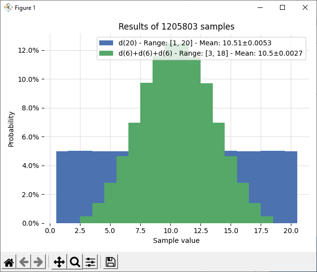
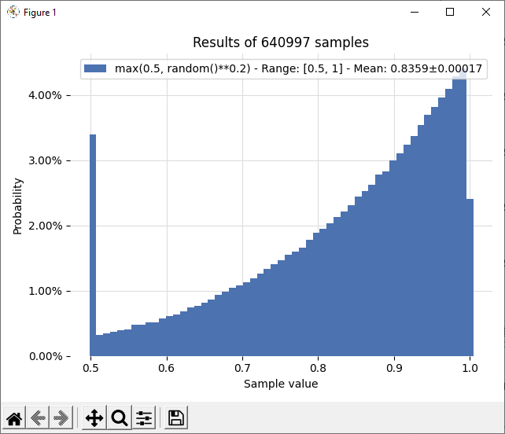

# carlo

Named after the Monte Carlo algorithm, this module displays interactive histograms of streaming/online data. It's meant for quickly visualizing distributions, and it'll keep refining its histogram as new data comes in.

Accepts lists, generators, numbers from stdin, or a function to be repeatdly evaluated. Displays data as histograms with automagic bin allocation, and extra statistics in legends.

## Example 1

Compare samples from one 20-sided dice vs three 6-sided dices.

Imported:

```python
from carlo import plot, d
plot(lambda: d(20), lambda: d(6)+d(6)+d(6))
```

Or as standalone module (where `d(n)` simulates the roll of a `n`-sided dice):

```bash
carlo "d(20)" "d(6)+d(6)+d(6)"
```



## Example 2

Sample values from `max(0.5, random()**0.2)`.

Imported:

```python
from carlo import plot
from random import random
plot(lambda: max(0.5, random()**0.2))
```

Or as standalone module (all functions from the `random` module are automatically available).

```bash
carlo "max(0.5, random()**0.2)"
```
    

